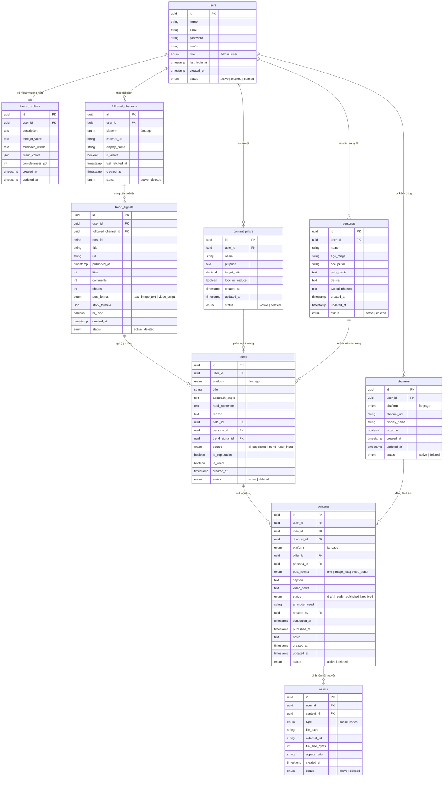

# ERD — AI Content Platform

Tài liệu này mô tả thiết kế cơ sở dữ liệu cho hệ thống hỗ trợ chủ shop nhỏ
sản xuất nội dung mạng xã hội bằng AI. Scope giới hạn theo PRD: chỉ Facebook,
miễn phí, không quản lý đơn hàng / quảng cáo / tự động đăng bài.

---

## 1. Tổng quan các nhóm bảng

| Nhóm | Bảng | Mô tả |
|---|---|---|
| **Auth** | `users` | Tài khoản người dùng |
| **Brand** | `brand_profiles`, `content_pillars`, `personas` | Hồ sơ thương hiệu — nguồn đầu vào cho AI |
| **Channel** | `channels`, `followed_channels`, `trend_signals` | Kênh của mình + kênh theo dõi + tín hiệu xu hướng |
| **Studio** | `ideas`, `contents`, `assets` | Ý tưởng → nội dung → ảnh/video |

Trục cô lập dữ liệu: **mọi bảng nghiệp vụ đều có `user_id`**, đảm bảo
dữ liệu của shop A không lộ sang shop B.

---

## 2. Mô tả chi tiết từng bảng

### 2.1 Nhóm Auth

#### `users` — Tài khoản người dùng
| Cột | Kiểu | Mô tả |
|---|---|---|
| `id` | UUID PK | Khóa chính |
| `name` | string | Tên hiển thị |
| `email` | string UNIQUE | Email |
| `password` | string UNIQUE | Mật khẩu |
| `avatar` | string | URL ảnh đại diện |
| `role` | enum | `admin`, `user`|
| `last_login_at` | timestamp | Lần đăng nhập cuối — xác định tài khoản còn dùng không |
| `created_at` | timestamp | Ngày tạo |
| `status` | enum | `active`, `blocked`, `deleted`|

---

### 2.2 Nhóm Brand

Đây là **bộ não thương hiệu** — nguồn đầu vào bắt buộc cho AI đề xuất nội dung.
Nếu hồ sơ trống, AI không có gì để bám vào.

#### `brand_profiles` — Hồ sơ thương hiệu
Mỗi user có đúng một hồ sơ thương hiệu.

| Cột | Kiểu | Mô tả |
|---|---|---|
| `id` | UUID PK | |
| `user_id` | UUID FK → users UNIQUE | Một user một hồ sơ |
| `description` | text | Mô tả thương hiệu / sản phẩm |
| `tone_of_voice` | text | Giọng điệu (ấm áp, chuyên nghiệp, hài hước...) |
| `forbidden_words` | text | Từ/cụm từ cấm dùng |
| `brand_colors` | json | Mảng mã màu `["#FF0000", "#FFFFFF"]` |
| `completeness_pct` | int | % độ đầy đủ hồ sơ — dưới 60% thì hạn chế đề xuất |
| `created_at` | timestamp | |
| `updated_at` | timestamp | |

#### `content_pillars` — Trụ cột nội dung
Các chủ đề / mục tiêu nội dung định kỳ của thương hiệu (VD: "Giáo dục", "Bán hàng", "Cộng đồng").
AI phải rải ý tưởng theo đúng tỉ lệ mục tiêu của từng trụ cột.

| Cột | Kiểu | Mô tả |
|---|---|---|
| `id` | UUID PK | |
| `user_id` | UUID FK → users | |
| `name` | string | Tên trụ cột |
| `purpose` | text | Mục đích của trụ cột |
| `target_ratio` | decimal | Tỉ lệ mục tiêu (0.0 – 1.0), tổng = 1.0 |
| `lock_no_reduce` | boolean | Khóa không cho AI tự giảm tỉ lệ trụ cột này |
| `created_at` | timestamp | |
| `updated_at` | timestamp | |
| `status` | enum | `active`, `deleted`|

#### `personas` — Chân dung khách hàng
Hồ sơ người mua mục tiêu. Ý tưởng nội dung phải gắn với một chân dung có thật —
AI không được bịa thêm chân dung mới.

| Cột | Kiểu | Mô tả |
|---|---|---|
| `id` | UUID PK | |
| `user_id` | UUID FK → users | |
| `name` | string | Tên chân dung (VD: "Mẹ bỉm sữa 28-35") |
| `age_range` | string | Độ tuổi |
| `occupation` | string | Nghề nghiệp |
| `pain_points` | text | Nỗi đau / vấn đề |
| `desires` | text | Mong muốn / mục tiêu |
| `typical_phrases` | text | Câu họ hay nói |
| `created_at` | timestamp | |
| `updated_at` | timestamp | |
| `status` | enum | `active`, `deleted`|

---

### 2.4 Nhóm Channel

#### `channels` — Kênh đăng của user
Các trang / profile Facebook của chính shop. Dùng để gắn bài đã đăng
và thu thập số liệu về sau.

| Cột | Kiểu | Mô tả |
|---|---|---|
| `id` | UUID PK | |
| `user_id` | UUID FK → users | |
| `platform` | enum | `fanpage` (hiện tại chỉ Facebook) |
| `channel_url` | string | URL trang Facebook |
| `display_name` | string | Tên hiển thị |
| `is_active` | boolean | Đang hoạt động không |
| `created_at` | timestamp | |
| `updated_at` | timestamp | |
| `status` | enum | `active`, `deleted`|

Ràng buộc: `UNIQUE(user_id, channel_url)`.

#### `followed_channels` — Kênh theo dõi để học
Các trang Facebook của đối thủ / cùng ngành mà user muốn theo dõi
để học chủ đề và công thức kể chuyện. Tách hoàn toàn khỏi `channels`
vì mục đích ngược nhau.

| Cột | Kiểu | Mô tả |
|---|---|---|
| `id` | UUID PK | |
| `user_id` | UUID FK → users | |
| `platform` | enum | `fanpage` |
| `channel_url` | string | URL trang theo dõi |
| `display_name` | string | Tên hiển thị |
| `is_active` | boolean | |
| `last_fetched_at` | timestamp | Lần thu thập dữ liệu gần nhất (`null` = chưa lần nào) |
| `created_at` | timestamp | |
| `status` | enum | `active`, `deleted`|

Ràng buộc: `UNIQUE(user_id, channel_url)`.

#### `trend_signals` — Tín hiệu xu hướng thu thập được
Các bài đăng thu thập từ `followed_channels`. Đây là nguyên liệu thô
để AI học **chủ đề** và **công thức kể** — không phải nội dung để sao chép.

| Cột | Kiểu | Mô tả |
|---|---|---|
| `id` | UUID PK | |
| `user_id` | UUID FK → users | |
| `followed_channel_id` | UUID FK → followed_channels | Kênh nguồn |
| `post_id` | string | Mã bài trên nền tảng (để tránh thu thập trùng) |
| `title` | string | Tiêu đề / câu mở đầu bài |
| `url` | string | Đường dẫn bài gốc (để trỏ nguồn) |
| `published_at` | timestamp | Thời điểm đăng |
| `likes` | int | Lượt thích (`null` = không đo được) |
| `comments` | int | Lượt bình luận |
| `shares` | int | Lượt chia sẻ |
| `post_format` | enum | `text`, `image_text`, `video_script` |
| `story_formula` | json | Công thức kể (hook, cấu trúc) — bóc tách sau khi thu thập |
| `is_used` | boolean | Đã dùng làm nguồn cho ý tưởng chưa |
| `created_at` | timestamp | |
| `status` | enum | `active`, `deleted`|

Ràng buộc: `UNIQUE(followed_channel_id, post_id)` — chống thu thập trùng.

---

### 2.5 Nhóm Studio

Đây là luồng sản xuất nội dung: **Thu thập → Phân tích → Ý tưởng → Nội dung → Asset**.

#### `ideas` — Ý tưởng nội dung
AI đề xuất hoặc người dùng tự nhập. Mỗi ý tưởng phải neo vào
trụ cột và chân dung **có thật** trong hồ sơ — không được bịa.

| Cột | Kiểu | Mô tả |
|---|---|---|
| `id` | UUID PK | |
| `user_id` | UUID FK → users | |
| `platform` | enum | Bề mặt đăng: `fanpage` |
| `title` | string | Tiêu đề ý tưởng |
| `approach_angle` | text | Góc tiếp cận |
| `hook_sentence` | text | Câu mở đầu gợi ý |
| `reason` | text | Lý do đề xuất — người dùng cần xem để đánh giá |
| `pillar_id` | UUID FK → content_pillars (nullable) | Trụ cột liên quan — `null` nếu AI trả về tên không khớp |
| `persona_id` | UUID FK → personas (nullable) | Chân dung nhắm tới — `null` nếu không khớp |
| `trend_signal_id` | UUID FK → trend_signals (nullable) | Bài gợi ý ý tưởng này (trỏ được về nguồn) |
| `source` | enum | `ai_suggested`, `trend`, `user_input` |
| `is_exploration` | boolean | Ý tưởng thăm dò hướng mới, chưa có dữ liệu lịch sử |
| `is_used` | boolean | Đã chuyển thành nội dung chưa |
| `created_at` | timestamp | |
| `status` | enum | `active`, `deleted`|

#### `contents` — Nội dung bài đăng
Bài đăng được sinh từ ý tưởng. Người dùng có thể chỉnh sửa sau khi AI tạo ra.

| Cột | Kiểu | Mô tả |
|---|---|---|
| `id` | UUID PK | |
| `user_id` | UUID FK → users | |
| `idea_id` | UUID FK → ideas (nullable) | Ý tưởng nguồn |
| `channel_id` | UUID FK → channels (nullable) | Kênh dự kiến đăng |
| `platform` | enum | `fanpage` |
| `pillar_id` | UUID FK → content_pillars (nullable) | Trụ cột |
| `persona_id` | UUID FK → personas (nullable) | Chân dung nhắm tới |
| `post_format` | enum | `text`, `image_text`, `video_script` |
| `caption` | text | Nội dung caption / bài viết |
| `video_script` | text | Kịch bản quay (phân cảnh), nếu có |
| `status` | enum | `draft` → `ready` → `published` → `archived` |
| `ai_model_used` | string | Tên model AI đã dùng để sinh |
| `created_by` | UUID FK → users | Người tạo |
| `scheduled_at` | timestamp | Ngày dự kiến đăng |
| `published_at` | timestamp | Ngày đăng thực tế |
| `notes` | text | Ghi chú của người dùng |
| `created_at` | timestamp | |
| `updated_at` | timestamp | |
| `status` | enum | `active`, `deleted`|

Vòng đời trạng thái:
```
draft → ready → published
  ↓
archived
```

#### `assets` — Tài nguyên đính kèm (ảnh, video)
Ảnh hoặc video gắn với một bài nội dung.
Ảnh được tải về và lưu local; video chỉ lưu URL ngoài vì dung lượng lớn.

| Cột | Kiểu | Mô tả |
|---|---|---|
| `id` | UUID PK | |
| `user_id` | UUID FK → users | |
| `content_id` | UUID FK → contents | Bài chứa asset |
| `type` | enum | `image`, `video` |
| `file_path` | string | Đường dẫn file local (ảnh tải về) |
| `external_url` | string | URL CDN gốc (video hoặc ảnh chưa tải về) |
| `file_size_bytes` | int | Kích thước file |
| `aspect_ratio` | string | Tỉ lệ khung hình (VD: `1:1`, `9:16`) |
| `created_at` | timestamp | |
| `status` | enum | `active`, `deleted`|

Ràng buộc: `CHECK(file_path IS NOT NULL OR external_url IS NOT NULL)` — phải có ít nhất một trong hai.

---

## 3. Sơ đồ ERD (Mermaid)



---

## 4. Luồng nghiệp vụ chính

```
[Thu thập]    followed_channels ──► trend_signals
                                         │
[Phân tích]                        story_formula (bóc công thức)
                                         │
[Đề xuất]     brand_profiles            │
              content_pillars  ──────►  ideas  ◄── user_input
              personas                   │
                                         │
[Sản xuất]                         contents (caption / video_script)
                                         │
[Tài nguyên]                        assets (ảnh / video)
```

---

## 5. Các ràng buộc quan trọng

1. **Cô lập user**: mọi bảng nghiệp vụ có `user_id` — query không được bỏ qua điều kiện này.
2. **Không bịa trụ cột / chân dung**: `pillar_id` và `persona_id` trên `ideas` là nullable — AI trả về tên không khớp hồ sơ thì đặt `null`, không tự thêm bản ghi mới.
3. **Không sao chép nội dung**: `trend_signals` chỉ cung cấp `story_formula` (công thức kể) cho AI, không truyền `caption` gốc vào prompt.
4. **Trỏ được về nguồn**: mỗi ý tưởng có `trend_signal_id` để người dùng bấm xem bài gốc đã gợi ý.
5. **Asset phải có đường dẫn**: `CHECK(file_path IS NOT NULL OR external_url IS NOT NULL)`.
